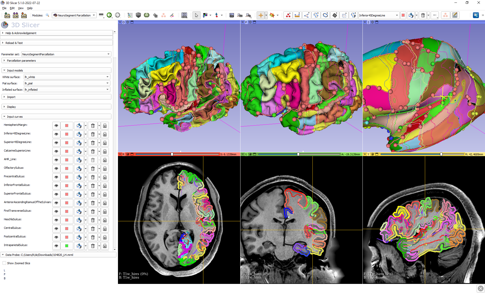

# SlicerNeuroSegmentation: HOA 2.0 Neurosegmentation And Neuroparcellation

SlicerNeuroSegmentation is an extension for [3D Slicer](http://slicer.org) designed to provide access to tools for segmenting neurological structures.

## Modules

- ### NeuroSegment
  This module provides access to tools for editing MRI images. Segments that are created using the module are automatically populated with the structures that need to be segmented.

- ### NeuroSegment Parcellation
  This module provides tools that facilitate the segmentation of structures in the cerebral cortex by defining planes and tracing along sulci that are represented 3D mesh imported from FreeSurfer.

- ### Curve Comparison
  This module evaluates the curve surface pathfinding parameters to find the parameters that perform optimally compared to a ground truth curve.

## User guides

- ### NeuroSegment
  Instructions on the steps required to perform segmentation of structures with NeuroSegment can be found [here](docs/General%20Segmentation.md).

- ### NeuroSegment Parcellation

## Support

If you encounter any issues or have any questions, feel free to submit an issue [here](https://github.com/PerkLab/SlicerNeuroSegmentation/issues/new).

## Acknowledgements

Development of SlicerNeuroSegmentation was partially funded by Brigham and Women's Hospital through NIH grant R01MH112748
