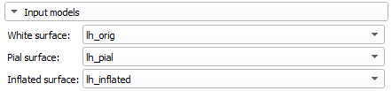
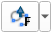
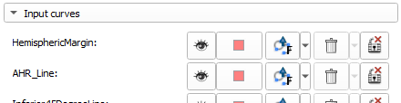
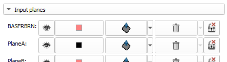
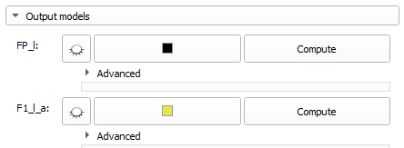
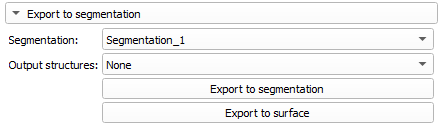

# Neuroparcellation


---

## Prerequisites

Tne Neuroparcellation module requires surfaces to be imported from FreeSurfer to serve as input.
Before using, the following surfaces must be imported from the same study using the "FreeSurfer Importer" module:
- White
- Pial
- Inflated

The following scalar overlays must also be imported with the models:
- sulc: Sulcal height
- curv: Curvature

---

## Query file

Parcellation units are defined by the contents of the query (.qry) file that is specified.
The format of query files can be seen below

<details Test="Test">
  <summary>Parcellation query file (.qry)</summary>

  ```python
  # Parcellation description file

  _Planes = [
    Plane # List of planes
  ]

  # Pathfinding weighting based on distance (d) curvature (c), height (h), direction (p)
  # Weighting can be redefined and will apply to curves initialized after.
  #                          [   d,   c,   h,  dc,  dh,  ch, dch,   p ]
  _DistanceWeightingValues = [ 1.0, 1.0, 1.0, 1.0, 1.0, 1.0, 1.0, 1.0 ]

  _Curves = [
    Curve # List of curves
  ]

  #
  _InvertScalars = True
  _Curves = [InvertedCurve] # Define curves that favour gyri rather than sulci
  _InvertScalars = False

  _ClosedCurves = [
    ClosedCurve # List of closed curves
  ]

  ParcellationUnit = Plane & anterior_of(Plane) & Curve & ClosedCurve & InvertedCurve # Output parcellation unit
  ParcellationUnit.color = [0,0,0]
  ```

</details>

---

## Instructions

### 1. Select input surfaces

- From the "Input models" section, select each of the imported FreeSurfer models.
  

### 2. Place curves in specified locations
- Place all of the input curves on the surface in the 3D views. Start by placing points at the start and end of the curve by clicking on this button . Right-click to end placement. If further refinement is required, points can be added to the middle of the curve later using ctrl+left click.

  

### 3. Place planes in specified locations
- Place planes in the 2D views as defined by the HOA 2.0 parcellation guide.

  

### 4. Compute output parcellations

- Once planes and curves have been defined, individual parcellation unit can be calculated by clicking on "Compute".

  

- All parcellation units can be computed at the same time by clicking on "Compute all".

  

### 5. Export parcellations units to segmentation

- Parcellation units can be exported to a segmentation by selecting an existing segmentation or creating a new one, and clicking "Export to segmentation". Exporting only a subset of the parcellation units can be controlled by checking structures in "Output structures".

  
